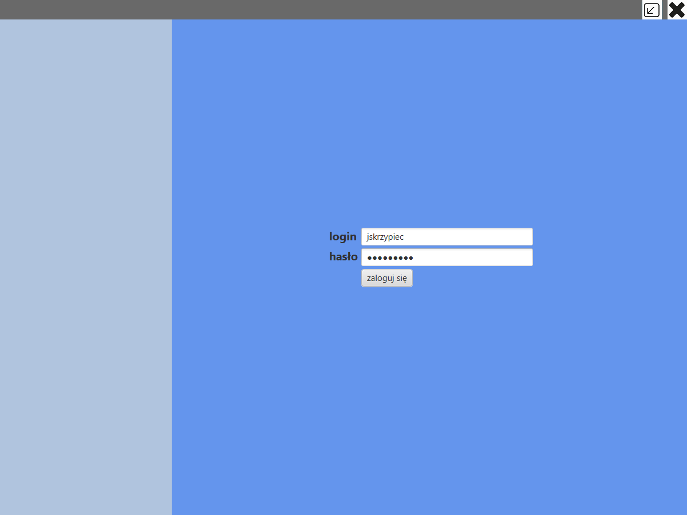
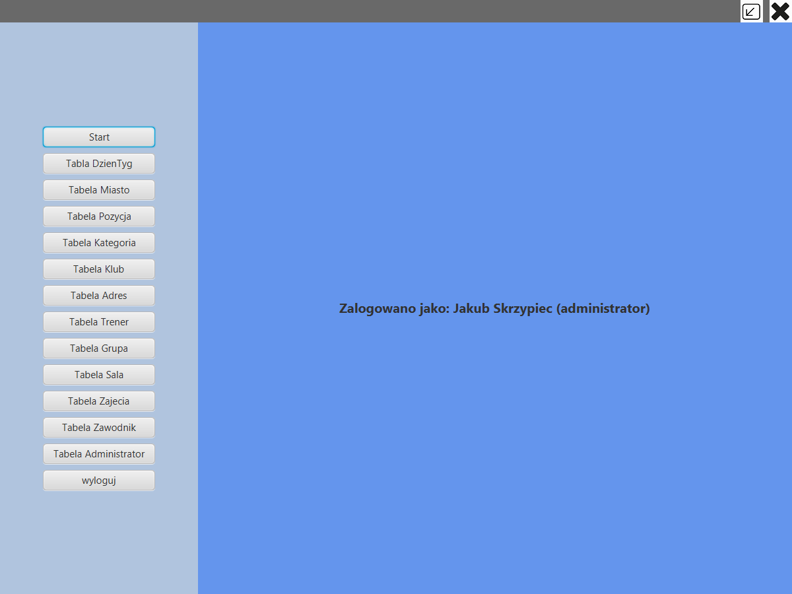
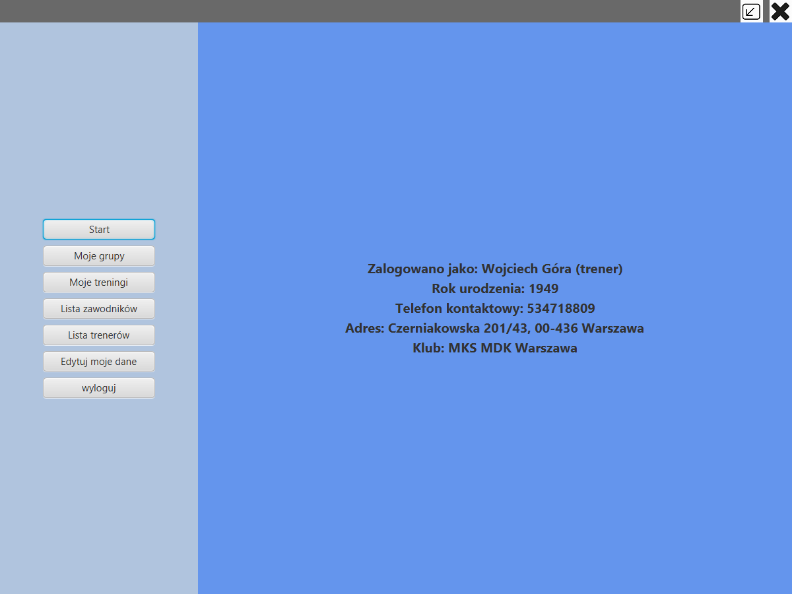
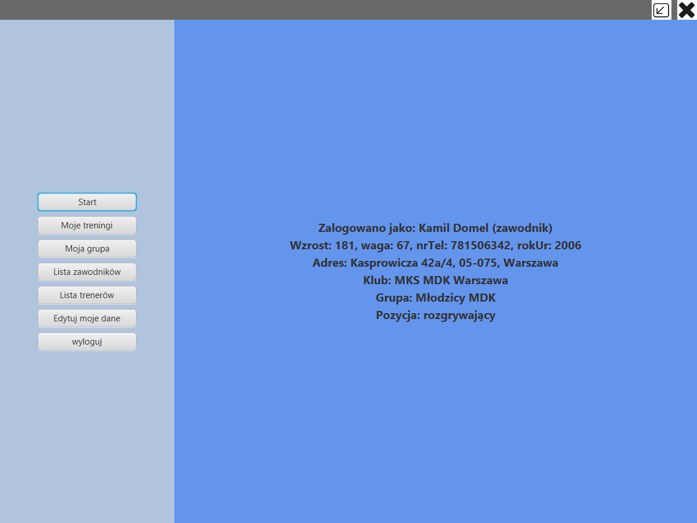
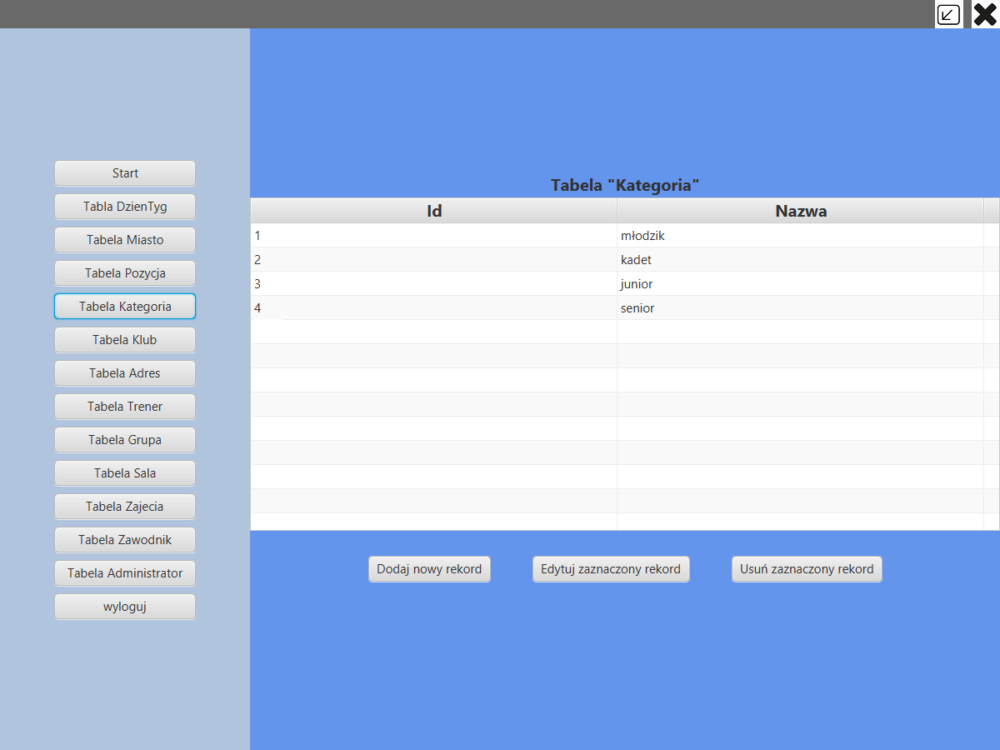
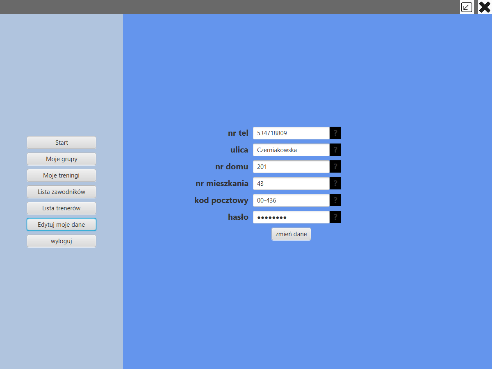
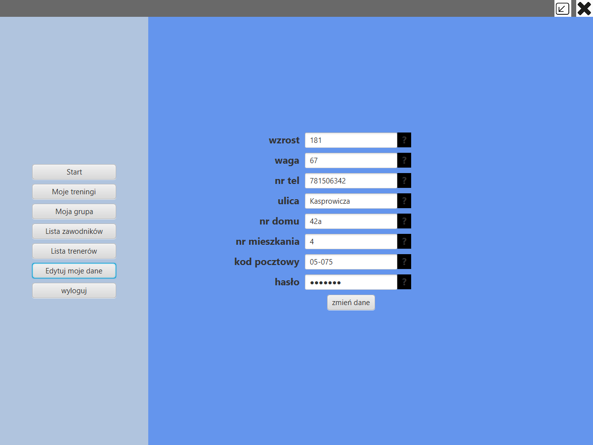

# Volleyball Club Management App
Java maven project made for 'Database applications' course at University of Gdańsk in 2019.  

## Getting Started
Before launching application, please run prepared scripts (/1 - database):  
`siatkarze2019_JSkrzypiec_1_tabele` - to create database structure (tables, relationships)  
`siatkarze2019_JSkrzypiec_2_inserty` - to insert data 

## About application
At the startup application displays login screen  
  
There are 3 types of users:
- Players  
- Trainers  
- Admins  

After successful login user sees 'start Screen' with short information about his account.  
Examples:  
Admin  
  
Trainer  
  
Player  
  

### Admin account
Admin can READ, INSERT, UPDATE and DELETE data in every table from database.  

### Trainer account
Trainer has limited access to data. Trainer is able to view only informations about his groups details, his trainings, players and trainers from his club. Trainer can change some informations about himself (not everything e.g. he can't change club info).  

### Player account
Player also has limited access to data. Player is able to view only informations about his trainings, his group details, players and trainers from his club. Player can change some informations about himself (not everything e.g. he can't change info about position, club).  

## Build With:  
- Maven  
- Hibernate  
- Java 8 (backend)  
- Javafx (frontend)
- Microsoft SQL Server (database) 

## Autor
- Jakub Skrzypiec (@jakub.skrzypiec - jakub.skrzypiec1@gmail.com)

